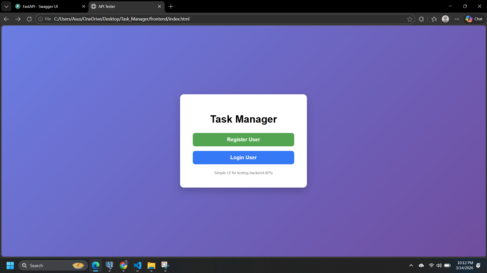
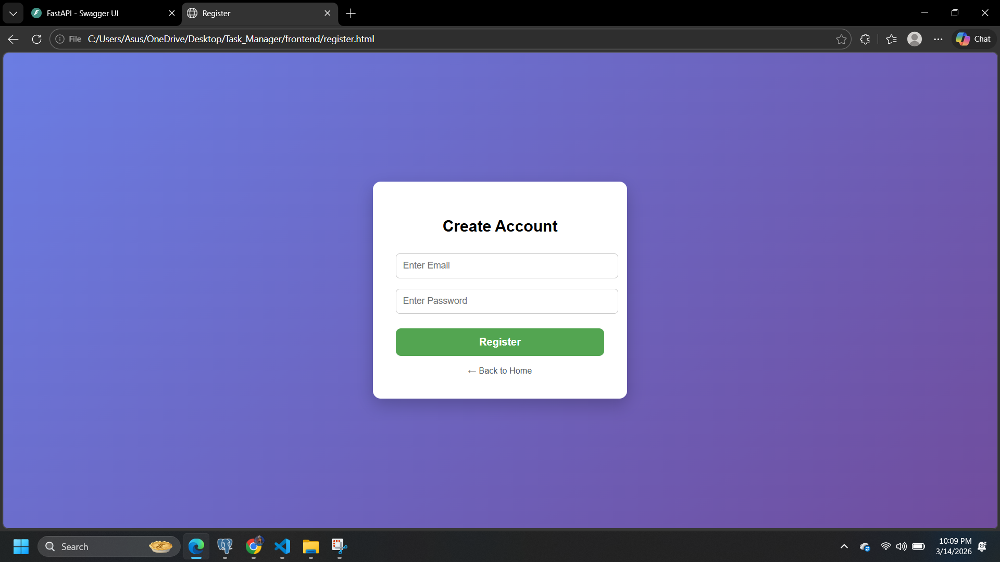
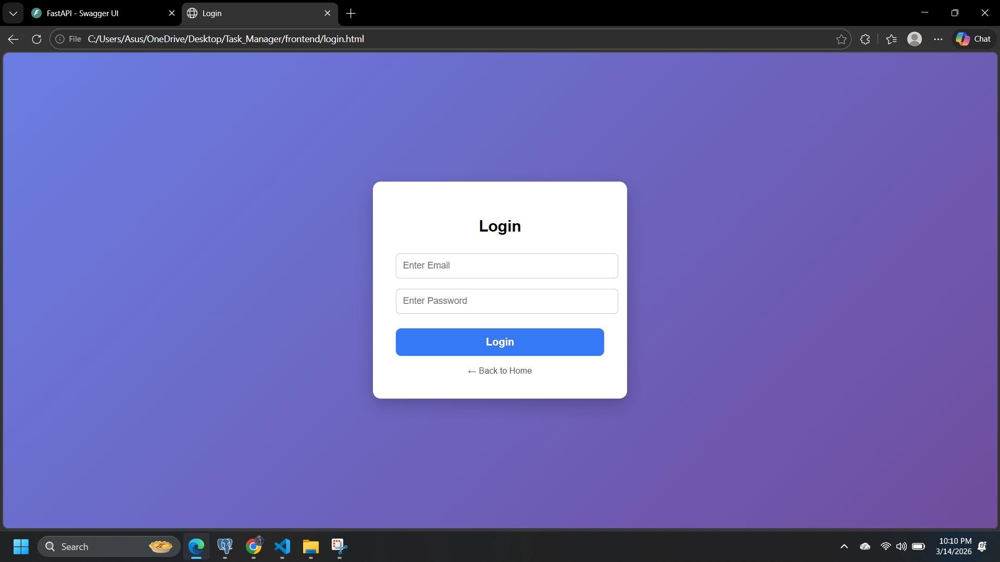
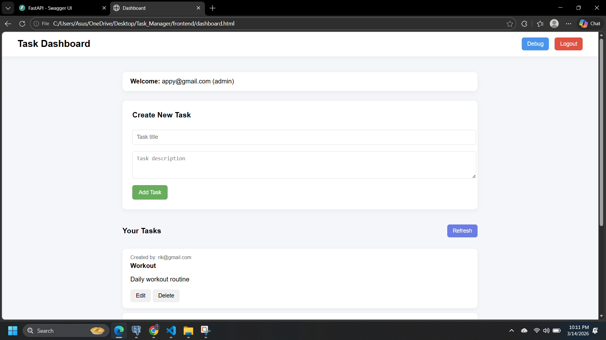
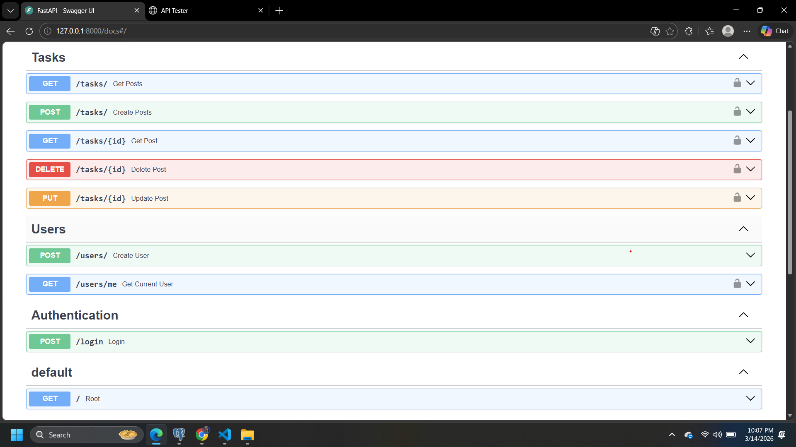

## Title and Description

Scalable Task Manager API with Authentication
A scalable REST API built using FastAPI with JWT Authentication, Role-Based Access Control, and a simple frontend UI for testing API functionality.

This project demonstrates secure backend architecture, modular API design, and scalable structure suitable for production systems.


## Tech Stack

### Backend
    -Python

    -FastAPI

    -PostgreSQL

    -SQLAlchemy

    -JWT Authentication

    -Passlib (Password Hashing)

### Frontend
    -React.js / Vanilla JS

    -Fetch API

    -Basic dashboard UI

### Tools
    -VS Code

    -Swagger UI

    -Postman

    -GitHub
# Features

## Authentication
    -User Registration

    -User Login

    -Password Hashing

    -JWT Token Authentication

## Role-Based Access
    -User role

    -Admin role

    -Protected endpoints

## CRUD Operations
  ### Task management system:

    -Create task

    -Read tasks

    -Update task

    -Delete task

## Security
    -Secure password hashing

    -JWT token validation

    -Input validation

    -Role-based authorization

## API Documentation
    -Swagger UI

    -Postman collection
# Project Screenshots

## Front Page


## Register Page


## Login Page


## Dashboard


## API Documentation (Swagger)



# Project Structure

```
Task_Manager
│
├── backend 
|   ├── app
|   |    ├── __init__.py
│   |    ├── main.py
│   |    ├── database.py
│   |    ├── models.py
│   |    ├── schemas.py
│   |    ├── auth.py
│   |    ├── auth2.py
│   |    │
│   |    ├── routers
│   |    │   ├── auth.py
│   |    │   ├── user.py
│   |    │   └── task.py
│   │
│   ├── alembic
|   ├── alembic.ini
│   └── requirements.txt
│
├── frontend
│   ├── index.html
│   ├── script.js
│   └── style.css
│
├── screenshots
│    ├── frontpage.png
│    ├── register.png
│    ├── login.png
│    ├── dashboard.png
|    └── swagger.png
|
└── README.md

```
# Installation

### 1. Clone Repository
    git clone https://github.com/thereetupaul/Task_Manager.git
    cd Task_Manager
    cd backend

### 2. Create Virtual Environment
    python -m venv venv
    
####  Activate environment

    Windows :
        venv\Scripts\activate

    Linux / Mac:
        source venv/bin/activate

### 3. Install Dependencies
    pip install -r requirements.txt
## Environment Variables
### Create a .env file:
    DATABASE_HOSTNAME=your_hostname
    DATABASE_PORT=your_port_no
    DATABASE_USERNAME=your_username
    DATABASE_PASSWORD=your_password
    DATABASE_NAME=your_database_name
    SECRET_KEY=your_secret_key
    ALGORITHM=HS256
    ACCESS_TOKEN_EXPIRE_MINUTES=30


## Running the Backend

    uvicorn app.main:app --reload
    
#### Server will start at :

    http://127.0.0.1:8000

## API Documentation

### Swagger UI

    http://127.0.0.1:8000/docs
    
### ReDoc

    http://127.0.0.1:8000/redoc
# API Reference

### Register User

```http
  POST /users/
```

| Parameter | Type     | Description                |
| :-------- | :------- | :------------------------- |
| `email`   | `string` | **Required**. User email   |
| `password`| `string` | **Required**. User password|


### Login User

```http
  POST /login
```

| Parameter | Type     | Description                |
| :-------- | :------- | :------------------------- |
| `email`   | `string` | **Required**. User email   |
| `password`| `string` | **Required**. User password|


### Get All Tasks

```http
  GET /tasks/
```

| Header           | Type     | Description                    |
| :----------------| :------- |:------------------------------ |
| `Authorization`  | `string` | **Required**. Bearer JWT token |


### Get Task by ID

```http
  GET /tasks/${id}
```

| Parameter | Type     | Description                       |
| :-------- | :------- | :-------------------------------- |
| `id`      | `string` | **Required**. Id of task to fetch |


### Create Task 

```http
  POST /tasks/
```

| Parameter    | Type     | Description                       |
| :--------    | :------- | :-------------------------------- |
| `title`      | `string` | **Required**. Task title          |
| `description`| `string` | **Required**. Task description    |


### Update Task

```http
  PUT /tasks/${id}
```

| Parameter | Type     | Description                       |
| :-------- | :------- | :-------------------------------- |
| `id`      | `string` | **Required**. Task Id             |


### Delete Task

```http
  DELETE /tasks/${id}
```

| Parameter | Type     | Description                       |
| :-------- | :------- | :-------------------------------- |
| `id`      | `string` | **Required**. Task Id             |

## Error Responses

#### Common  Status Codes

|  Code   |  Meaning     |
| :------ | :-----       |
|  200    |  OK          |
|  201    |  Created     |
|  400    |  Bad Request |
|  401    |  Unauthorized|
|  403    |  Forbidden   |
|  404    |  Not Found   |
|  500    |  Server Error|

## Frontend UI

A basic frontend interface is included to test the APIs.

### Features:

    -Register new users

    -Login and receive JWT token

    -Access protected dashboard

    -Perform CRUD operations on tasks

    -Display API responses

### Run frontend by opening:

    Task_Manager/frontend/index.html


## Security Measures

    -Passwords hashed using bcrypt

    -Secure JWT token authentication

    -Protected routes using OAuth2

    -Input validation using Pydantic
# Scalability Notes

This project is designed with scalability in mind. The following improvements can be implemented for production environments:

### Modular Architecture
The backend follows a modular structure (routers, models, schemas, services) which allows new modules to be added easily without affecting existing code.

### Microservices
The system can be separated into independent services such as:
- Authentication Service
- User Management Service
- Task Management Service

### Caching
Redis can be integrated to cache frequently accessed data such as task lists or user sessions to reduce database load.

### Load Balancing
Multiple API instances can run behind a load balancer (e.g., Nginx) to distribute traffic.

### Containerization
Docker can be used to containerize the application, making deployment easier and scalable across cloud environments.
## Evaluation Checklist
### This project satisfies the following requirements:

    -REST API design

    -JWT authentication

    -Role-based authorization

    -CRUD operations

    -Database integration

    -Frontend API interaction

    -API documentation

    -Scalable architecture

### ## Author

- [Reetu Paul](https://github.com/thereetupaul)

